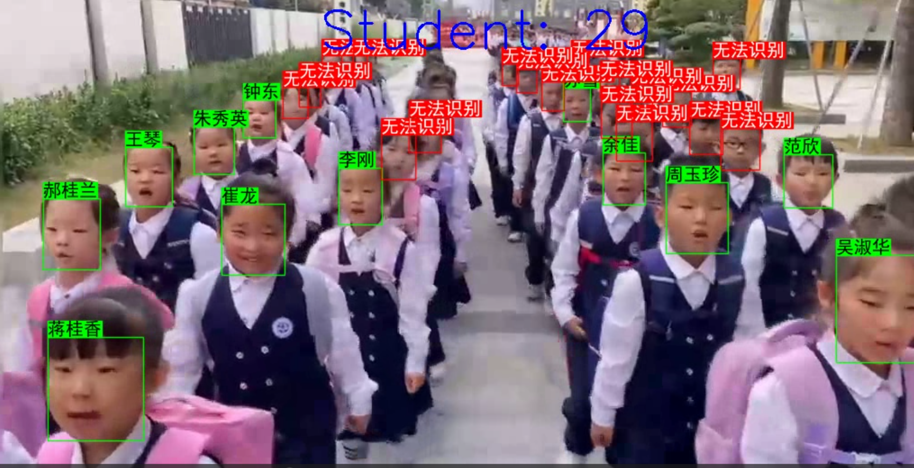
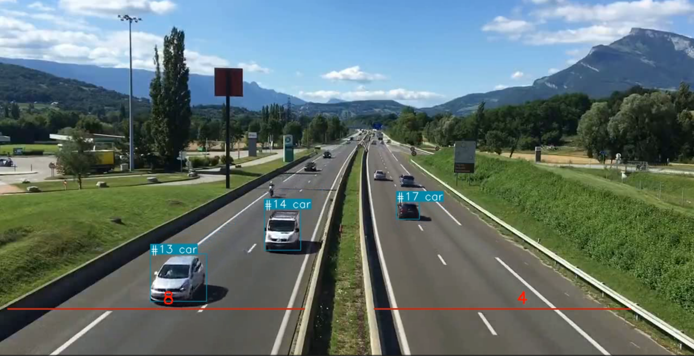

# 智慧校园人脸无感识别检测系统

>  对于某时段校园门口学生出入的视频，使用YOLOv8目标检测算法以及yolov8l-face模型将目标换算成只检测人脸，其次通过track技术实现检测出的人脸进行自动跟踪，通过跟踪到的人脸使用dlib的dlib_face_recognition_resnet_model_v1模型来提取人脸的特征，也就是128个特征值，如果可以检测到特征值的会标绿，而未检测到的人脸将标红，同时统计出能识别出的人脸的数量

> 从网上找出部分人脸视频使用该系统检测效果也不错

# 公路车辆识别系统

> 基于yolov8开发出的识别系统，实现原理与上面差不多

